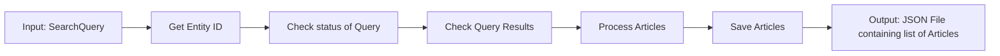

# Inriskable API Connector README

---

Title: Inriskable API data connector documentation
Author: Alvin Leung (BJB Global Innovation Lab)
Date: 22nd July 2024

---

## Overview

This API connector fetches news articles related to specified entities (names and companies) using the Inriskable API. It processes the fetched articles to include details like summaries, sentiment scores, and associated images. The results are then saved in a structured JSON format according to the template classes provided by LEDR.

---

## Information Flow Diagram



---

## Processing Details

### Step 1: Get Entity ID

#### **Function**: `get_query_id`

- **Description**: Fetches the unique ID for the entity (name or company) from the Inriskable API. Uses cached results if available and recent.
- **Logic**: For each entity name in the SearchQuery, check if it belongs to names or companies to determine entity_type. Afterwards run the name through a language checker to get the language it is in. Use the name, language and entity_type as inputs for the API call.
- **Things to take note of**:
  - Currently the language checker package used has a tendency to classify Chinese names as Korean.
  - Consequently all Korean detected names are considered Chinese since we assume that only English and Chinese Characters will be entered as names. 
  - Should a name be classified to be non-English/Chinese/Korean we check both English and Chinese search.

### Step 2: Check Query Results

#### **Function**: `check_query`

- **Description**: Checks the status of the query using the entity ID and fetches the results once available.
- **Logic**: Given that Inriskable API cannot handle many simultaneous POST requests (Results in 422 response), we stagger the concurrent processes by 0.5s to resolve the issue. Upon the initial sending of the POST request, we send the first get request after 60s (this can be changed), attempting to get the articles Inriskable has identified as relevant, returning the articles once status changes from 'pending' to 'completed'. Should the status still be pending we wait for 90s before sending another request.
- **Things to take note of**: 
  - Handling of API rate limits, timeout management all have not yet been fully optimized.
  - We can collect statistics on how long it takes Inriskable to return results to minimize the number of API calls required while reducing the waiting time.
  - Currently if many articles are processed sometimes Python kills the thread due to memory running out. This might be something to take note of.
  - One possible optimization would be to write to a json as the articles are processed then overwrite the article so as to not keep the articles in memory. Subsequently the json can be read from and used to reconstruct the full list.

### Step 3: Process Articles

#### **Function**: `fetch_articles_for_entity`

- **Description**: Fetches news articles related to a specific entity (name or company) based on a search query.
- **Logic**:
  - Determines the type of entity (company or individual) and retrieves its ID using `get_query_id`.
  - Uses the retrieved ID to query for articles with `check_query`.
  - Processes the response to extract and filter relevant articles.
  - For each article, extracts details such as title, content, and publication date, generates summaries, calculates sentiment, and fetches associated images.
- **Things to Take Note Of**:
  - The language of the articles needed to be handled appropriately to ensure accurate summarization and sentiment analysis.
  - Rate limits and delays for API calls might have to be built in to avoid being throttled or blocked.
  - Chinese language articles are returned in a Unicode format.

#### **Function**: `get_summary`

- **Description**: Generates a summary of the article content using a pre-trained BART model.
- **Logic**:
  - Chooses the BART model based on the language of the article ('en' for English, 'zh' for Chinese).
  - Tokenize the article content and generates a summary using the BART model.
  - Decodes the summary from token IDs to a human-readable string.
- **Things to Take Note Of**:
  - Ensured that the selected model matches the language of the article.
  - Currently the summary model only accept 1024 tokens maximum as input, hence information contained in the latter part of long articles would not be included.

#### **Function**: `get_sentiment_score`

- **Description**: Calculates the sentiment score of the article content using a pre-trained BERT model.
- **Logic**:
  - Tokenize the article content into chunks that fit within the BERT model's input limits.
  - For each chunk, computes the sentiment probabilities using the BERT model.
  - Scores are returned in the form of a vector of size 3, with the probabilities for positive, negative and neutral sentiment, with the probabilities adding up to 1. (e.g. [1, 0 ,0] for a positive article)
  - Aggregates the probabilities and computes a weighted average to derive the overall sentiment score.
  - The final score is calculated by taking the positive probability and subtracting the negative probability.
- **Things to Take Note Of**:
  - Size constraints were managed by chunking long articles.
  - Handling of sentiment scoring are managed by weighing the scores of the chunk according to their length, including the mapping from probabilities to sentiment scores.
  - The sentiment score is a float in the range [-1, 1], where -1 is very negative, 0 is neutral, and 1 is very positive.

#### **Function**: `get_bloomberg_article`

- **Description**: Fetches the title and content of a Bloomberg article from the given link.
- **Logic**:
  - Makes an HTTP GET request to the Bloomberg article link.
  - Parses the HTML content to extract the article's title and body using BeautifulSoup.
- **Things to Take Note Of**:
  - This function is necessary since Inriskable API is being blocked by Bloomberg's anti-scraping measures, and returns title "Bloomberg - Are you a robot?".
  - Potential for changes in Bloomberg's HTML structure which might require updates to the parsing logic later.
  - Rate limits and delays for API calls might have to be built in to avoid being throttled or blocked.

#### **Function**: `get_image_from_link`

- **Description**: Fetches the URL of an image associated with the article from the given link.
- **Logic**:
  - Makes an HTTP GET request to the article link.
  - Parses the HTML content to locate and extract the image URL, checking both Open Graph meta tags and standard image tags.
- **Things to Take Note Of**:
  - Currently unable to handle cases where the image might be missing or the HTML structure differs from expectations.
  - Not all image URLs are valid and accessible.
  - Rate limits and delays for API calls might have to be built in to avoid being throttled or blocked.


### Step 4: Save Articles

#### **Function**: `process_articles`

- **Description**: Processes a list of `NewsArticle` objects to remove duplicates and organize the articles in a structured format.
- **Logic**:
  - Initializes a dictionary to track unique articles by title.
  - Iterates over the list of articles, using the article title as a key in the dictionary.
  - If an article with the same title already exists, increments its count. If not, adds the article data to the dictionary.
  - Returns a list of dictionaries, including a count of how many times each article title appeared.
- **Things to Take Note Of**:
  - Ensured that articles with the same title are correctly identified as duplicates.
  - This is based on the assumption that articles with identical titles are likely to be the same or very similar.

#### **Function**: `save_articles_to_json`

- **Description**: Saves the processed list of articles to a JSON file.
- **Logic**:
  - Calls `process_articles` to deduplicate and structure the list of articles.
  - Writes the processed articles to a JSON file using the `json.dump` method.
  - Handles exceptions that may occur during file operations to ensure that the articles are saved correctly or alternative actions are taken in case of failure.
- **Things to Take Note Of**:
  - **File Path Management**: Ensure that the file path provided is valid and accessible. Handle cases where the directory might not exist or where there are permission issues.
  - **Error Handling**: Implement robust error handling to catch and report issues that might arise during file writing, such as permission errors or invalid file paths.
  - **Data Formatting**: Ensure that the JSON output is well-formatted for readability and consistency. Use the `indent` parameter of `json.dump` to create a readable format.
  - **Backup and Overwrite**: Consider scenarios where the file might already exist. Implement logic to handle file overwriting or create backups if necessary.

---

## Individual Function Documentation

### Main File

#### `fetch_articles_for_entity`

- **Parameters**:
  - `entity` (str): The name of the entity (name or company).
  - `query` (SearchQuery): The search query parameters.
- **Returns**: List of `NewsArticle` objects.

#### `fetch_articles_with_delay`

- **Parameters**:
  - `entity` (str): The name of the entity (name or company).
  - `query` (SearchQuery): The search query parameters.
  - `delay` (float): The delay in seconds before making the request.
- **Returns**: List of `NewsArticle` objects.

#### `get_articles`

- **Parameters**:
  - `query` (SearchQuery): The search query parameters.
- **Returns**: List of `NewsArticle` objects.

---

### Utils File

#### `get_query_id`

- **Parameters**:
  - `query` (str): The name of the entity.
  - `entity_type` (str): The type of entity (name or company).
- **Returns**: The unique ID for the entity.

#### `check_query`

- **Parameters**:
  - `id` (str): The unique ID of the query.
- **Returns**: The query results as a dictionary.

#### `get_summary`

- **Parameters**:
  - `article_content` (str): The content of the article.
  - `lang` (str): The language of the article ('en' or 'zh').
- **Returns**: The summary of the article.

#### `get_sentiment_score`

- **Parameters**:
  - `article_content` (str): The content of the article.
  - `lang` (str): The language of the article ('en' or 'zh').
- **Returns**: The sentiment score as a float.

#### `get_bloomberg_article`

- **Parameters**:
  - `link` (str): The URL of the Bloomberg article.
- **Returns**: The title and content of the article.

#### `get_image_from_link`

- **Parameters**:
  - `link` (str): The URL of the article.
- **Returns**: The image URL as a string.

#### `process_articles`

- **Parameters**:
  - `articles` (List[NewsArticle]): The list of articles to process.
- **Returns**: List of dictionaries containing unique articles.

#### `save_articles_to_json`

- **Parameters**:
  - `articles` (List[NewsArticle]): The list of articles to save.
  - `filename` (str): The name of the JSON file.
- **Returns**: None.

---

### Template File

#### `NewsArticle`

- **Attributes**:
  - `publication_date` (datetime | None): The publication date of the article.
  - `title` (str): The title of the article.
  - `link` (str): The URL of the article.
  - `content` (str): The content of the article.
  - `summary` (str): The summary of the article.
  - `source` (str): The source of the article.
  - `sentiment` (float): The sentiment score of the article.
  - `keywords` (list[str]): The keywords associated with the article.
  - `categories` (list[str]): The categories associated with the article.
  - `image` (str | None): The URL of the image associated with the article.
- **Methods**:
  - `to_dict`: Converts the `NewsArticle` object to a dictionary. This method was added to support the saving of results and is not required for the get_articles function to run.

#### `SearchQuery`

- **Attributes**:
  - `names` (list[str]): The names of the entities.
  - `companies` (list[str]): The companies associated with the entities.
  - `language` (str): The language of the articles.
  - `since` (datetime | None): The date since when to fetch the articles.

---

## Running the Python File

### Setting Up the Environment

- **Create a new conda environment:**

    ```bash
    conda create --name inriskable python=3.11 -y
    ```

- **Activate the conda environment:**

    ```bash
    conda activate inriskable
    ```

### Running the Function on the Test Set

- **Execute the Python script:**

    ```bash
    pip install -r requirements.txt
    python concurrent_news_api.py
    ```

### Creating `requirements.txt` and Installing Packages

This section is just to document how I created the requirements.txt file, since the file has already been created there is no need to run these commands.

1. **Install `pipreqs` to generate `requirements.txt`:**

    ```bash
    conda install pipreqs -y
    ```

2. **Generate `requirements.txt` with `pipreqs`:**

    ```bash
    pipreqs --force
    ```

3. **Install packages listed in `requirements.txt`:**

    ```bash
    while read requirement; do conda install --yes $requirement; done < requirements.txt
    ```
